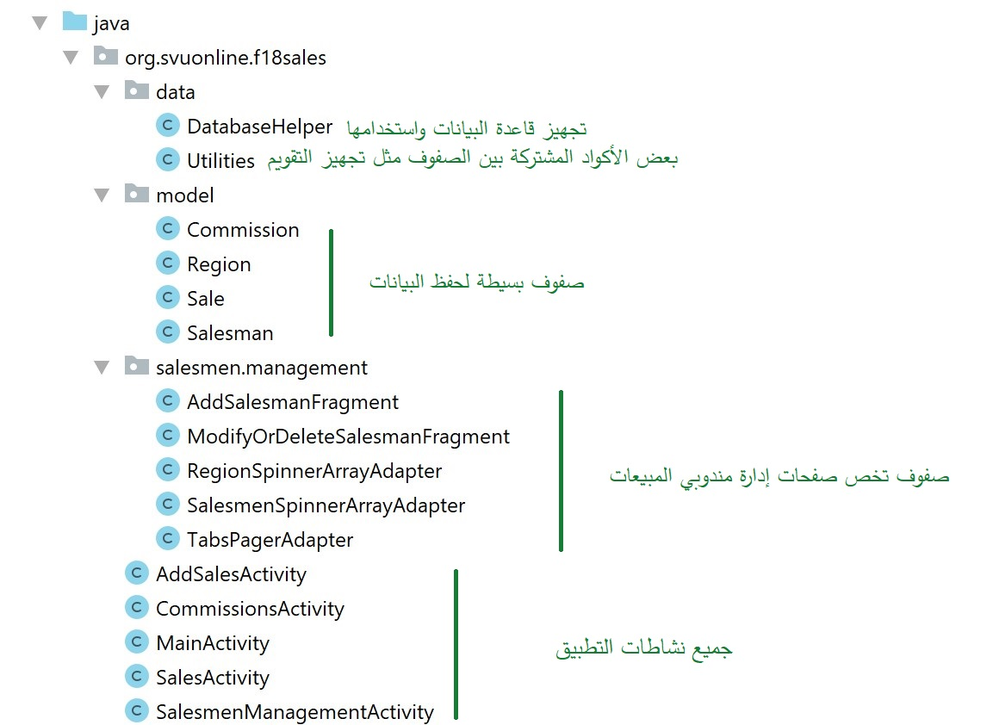
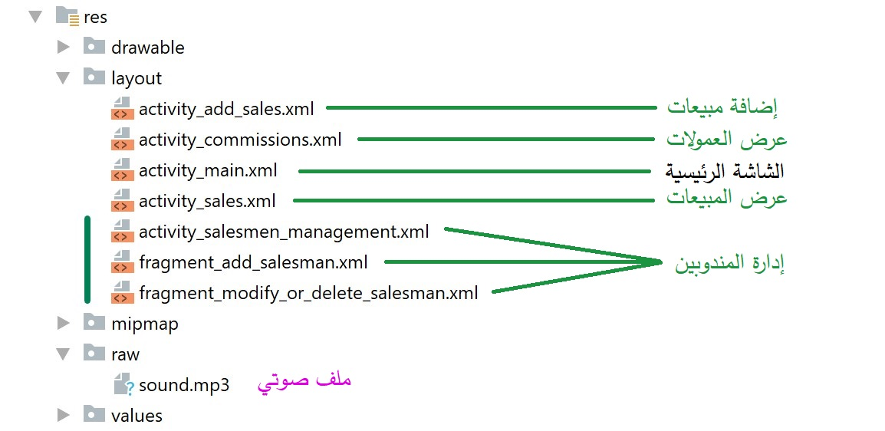
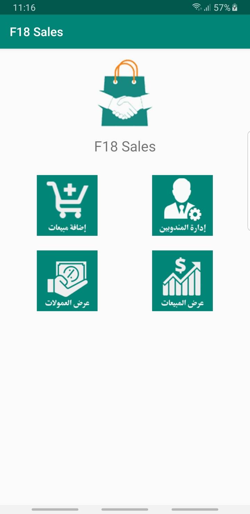

# bait-iwb303-f18-sales
وظيفة الجامعة الافتراضية السورية - تطبيق أندرويد يتيح إضافة مندوبين مبيعات وإضافة مبيعات له في منطقة محددة وحساب عمولاته تلقائيا

قاعدة البيانات SqLite

## Java code structure

## Resources files

## Main Activity

Android Studio version 3.4.1

تجدزن ملف نص الوظيفة في الملف
BAIT_IWB303_MuhammadMazenALmustafa_F18_HW.pdf
